# 🏖️ App de Gestão de Férias

## 📱 Teste Técnico – React Native (Expo)

Aplicativo mobile desenvolvido em **React Native (Expo)** para **gestão e controle de solicitações de férias corporativas**.

O projeto foi construído com foco em:

- 🧠 **Arquitetura Limpa**
- 🧩 **Princípios SOLID**
- 📡 **Offline-First (funciona mesmo sem internet)**
- 🎨 **UX refinada** (Dark Mode e Splash Screen otimizada)
- 🚀 **Escalabilidade e manutenibilidade**

---

## ✨ Visão Geral

Este app simula um ambiente corporativo real, com **diferentes perfis de acesso**, fluxo de aprovação de férias e controle completo via Firebase.

> Ideal para avaliação de **boas práticas**, **organização de código** e **experiência do usuário**.

---

## ⚠️ Configuração Obrigatória (`.env`)

Por questões de **segurança e boas práticas**, as chaves do Firebase **não são versionadas no Git**.

### 🔐 Para o projeto funcionar corretamente:

1. Localize o arquivo **`.env`** enviado em anexo  
   (por e-mail ou junto com o APK).
2. Mova este arquivo para a **raiz do projeto**  
   (no mesmo nível do `package.json`).
3. ⚠️ **Sem esse arquivo, o app não conectará ao banco de dados.**

---

## 🚀 Como Rodar o Projeto

### 🧱 Pré-requisitos

- Node.js
- JDK
- Android Studio
- Ambiente React Native configurado

---

### 1️⃣ Instalar Dependências

```bash
npm install
# ou
yarn install
```

---

### 2️⃣ Executar no Android

> ⚠️ **Atenção:**  
> Este projeto utiliza **módulos nativos customizados** (Firebase nativo e Splash Screen).  
> O **Expo Go da Play Store NÃO FUNCIONA**.

Você deve gerar um **Development Build** local:

```bash
npx expo run:android
```

---

## 🔑 Credenciais para Teste

O banco de dados já possui usuários cadastrados com **diferentes níveis de permissão**, facilitando a validação do fluxo completo da aplicação.

🔐 **Senha padrão para todos os usuários:** `123456`

| Perfil          | E-mail           | Função                                       |
| --------------- | ---------------- | -------------------------------------------- |
| **Admin**       | admin@teste.com  | Aprovar usuários e gerenciar todas as férias |
| **Gestor**      | gestor@teste.com | Visualizar solicitações e status do time     |
| **Colaborador** | colab@teste.com  | Solicitar férias e acompanhar histórico      |

---

## 📴 Testando Offline

1. Desconecte o dispositivo da internet
2. Navegue pelas telas (dados já carregados permanecem)
3. Ações críticas são bloqueadas, mantendo integridade
4. Reconecte e veja a sincronização automática

---

## 🛠️ Tech Stack & Arquitetura

### 🔧 Stack Principal

- **Framework:** React Native + Expo (SDK 50+)
- **Linguagem:** TypeScript
- **Estilização:** NativeWind (TailwindCSS) + Lucide Icons
- **State Management:** Zustand
- **Backend:** Firebase (Auth e Firestore)
- 🔐 **Autenticação:** Login e gerenciamento de usuários realizados via **Firebase Authentication**, incluindo funcionalidade de **reset de senha diretamente pelo Firebase**.

---

### ⭐ Destaques Técnicos

#### 🖼️ Splash Screen Híbrida

- Eliminação do _flash branco_ nativo do Android
- Transição fluida entre SO e React Native

#### 🧠 Arquitetura (SOLID)

- **Services:** Firebase isolado da UI
- **Hooks (Controllers):** Regras de negócio separadas das telas
- **Utils:** Helpers puros (erros, validações)

#### 🎨 UX/UI

- 🌙 Dark Mode completo
- 📡 Detecção de modo offline com feedback visual
- ⏳ Estados de loading claros e otimizados

---

## 📦 APK (Debug)

Um arquivo **.apk** foi enviado em anexo.

- ✔️ Instalação direta em dispositivos Android
- ✔️ Ideal para validação rápida
- ✔️ Dispensa ambiente de desenvolvimento

---

## 📌 Status do Projeto

- ✅ Funcional
- ✅ Estruturado para escalar
- ✅ Desenvolvido como **Teste Técnico**

---

## 🗂️ Estrutura do Projeto

O projeto segue uma arquitetura **feature-based**, visando escalabilidade e isolamento de responsabilidades.

```text
src/
 ├── components/        # Componentes reutilizáveis (UI)
 ├── features/          # Domínios da aplicação (Admin, Auth, Vacations)
 │    ├── screens/      # Telas
 │    ├── hooks/        # Controllers / regras de negócio
 │    ├── services/     # Comunicação com Firebase
 │    └── schemas/      # Validações e regras de domínio
 ├── hooks/             # Hooks globais (ex.: network status)
 ├── navigation/        # Controle de rotas e permissões
 ├── utils/             # Funções puras e helpers
 └── types/             # Tipagens globais
```

---


## Controle de Acesso & Permissões

O app possui **controle de permissões baseado em perfil**:

- **Colaborador:** solicita e acompanha férias
- **Gestor:** visualiza e decide solicitações do time
- **Admin:** gerencia usuários e regras do sistema

### Como funciona:

- O perfil do usuário é carregado no login
- As rotas são protegidas no nível da navegação
- Telas e ações são renderizadas dinamicamente conforme o papel
- Em modo offline, ações administrativas são automaticamente bloqueadas

---

## ⚙️ Regras de Negócio Dinâmicas

O aplicativo permite que o **Administrador** configure as regras de validação em tempo real, refletindo instantaneamente para todos os usuários:

- 📅 **Antecedência Mínima Configurável:** O Admin define a quantidade exata de dias de antecedência exigidos para uma nova solicitação (ex: 1 dia, 7 dias, 30 dias ou valor personalizado).
- 🔀 **Concorrência:** Controle sobre a permissão de abrir novas solicitações enquanto o usuário ainda possui outras pendentes.
- 🛡️ **Supervisão do Admin:** Habilita ou desabilita a capacidade do Admin de atuar na aprovação de férias, além dos Gestores.

```mermaid
graph LR
    User((Usuário)) --> Login[Tela de Login]
    Login --> Auth{Autenticado?}

    Auth -- Não --> Error[Exibe Erro]
    Auth -- Sim --> Fetch[Busca Perfil Firestore]

    Fetch --> Role{Qual Perfil?}

    Role -- ADMIN --> AdminScreen[Painel Admin]
    Role -- GESTOR --> ManagerScreen[Painel Gestor]
    Role -- COLABORADOR --> EmployeeScreen[Home Colaborador]

    subgraph Permissões
        AdminScreen -->|Aprova| Users[Usuários]
        ManagerScreen -->|Aprova| Vacations[Férias]
        EmployeeScreen -->|Solicita| MyVacation[Minhas Férias]
    end

    style Role fill:#ffecb3,stroke:#ff6f00,stroke-width:2px
```



## 📡 Estratégia Offline-First

- Persistência local de dados já carregados
- Detecção de conectividade em tempo real
- Interface adaptativa para modo offline
- Ações críticas sensíveis a concorrência (ex: aprovação) são **bloqueadas em modo offline**
- A sincronização prioriza **consistência e integridade** dos dados
- As ações são sincronizadas automaticamente quando a conexão é restabelecida

---



```mermaid
sequenceDiagram
    participant App as App (Offline)
    participant Local as Cache Local
    participant Network as Rede
    participant Server as Firebase (Server)

    Note over App, Server: Cenário: Gestor aprova Férias sem Internet

    App->>App: Ação: APROVAR Férias
    App->>Local: Grava Status "APPROVED" (Optimistic UI)
    App--xNetwork: Falha de Conexão

    Note over App: Usuário vê "Aprovado" e continua usando

    Network->>App: Conexão Restaurada 📡
    App->>Server: Envia update { status: APPROVED }

    alt Status no Servidor é PENDING?
        Server->>Server: Aceita Escrita ✅
        Server-->>App: Sucesso (Sync OK)
    else Status já mudou (Conflito)?
        Server->>Server: Regra de Segurança Bloqueia 🚫
        Server-->>App: Erro: Permission Denied
        App->>Local: Reverte para status do Servidor
        App->>App: Atualiza UI (Rollback)
    end
```

## 🧪 Testes

O projeto possui testes unitários focados em **regras de negócio e validações**.

### Exemplos:

- Schemas de férias
- Utilitários de data

Os testes priorizam:

- Casos críticos
- Regras de domínio
- Funções puras

---

## 🧠 Decisões Técnicas

- **Zustand** para estado global simples e previsível
- **Hooks como controllers**, evitando lógica nas telas
- **Services isolados** para facilitar troca de backend
- **Feature-based architecture** para escalar sem refatorações grandes

---

### 🔐 Consistência de Dados & Concorrência

Para evitar conflitos em cenários offline, a aprovação de solicitações segue regras de consistência no Firestore:

- Gestores só podem aprovar/reprovar solicitações com status `PENDING`
- Caso outro gestor já tenha decidido, escritas offline atrasadas são bloqueadas
- Administradores possuem permissão para correção manual a qualquer momento

Essa estratégia evita problemas de **Last Write Wins** em ambientes offline-first.

---

## 📸 Screenshots do App

### 🔐 Autenticação

<p align="center">
  
  
</p>

---

### 👤 Colaborador — Online

<p align="center">
  
  
  
  
  
</p>

---

### 👤 Colaborador — Offline

<p align="center">
  
  
  
</p>

---

### 🗓️ Criação & Calendário de Solicitação

<p align="center">
  
  
  
  
</p>

---

### 🧑‍💼 Gestor — Online

<p align="center">
  
  
</p>

---

### 🧑‍💼 Gestor — Offline

<p align="center">
  
  
</p>

---

### 🛡️ Admin — Home & Usuários

<p align="center">
  
  
  
  
</p>

---

### 🛡️ Admin — Aprovação & Desativação

<p align="center">
  
  
  
  
  
  
</p>

---

### ⚙️ Admin — Regras de Negócio

<p align="center">
  
  
</p>

---

### ✅ Solicitações Finalizadas

<p align="center">
  
  
</p>

> 💼 **Desenvolvido como Teste Técnico**
> 📱 React Native • Expo • Firebase • Clean Architecture

```

```

```

```

```

```
